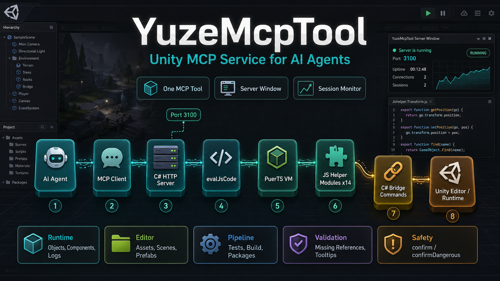

# YuzeMcpTool

[](https://unity.com/releases/editor/archive)
[](https://modelcontextprotocol.io/)
[](https://github.com/Tencent/puerts)
[](LICENSE)
[](#status-and-guarantee)

[中文](README_zh.md) | [Client setup](docs/CLIENT_SETUP.md) | [Helper reference](docs/HELPER_MODULES.md) | [Project design](docs/PROJECT_DESIGN.md) | [Advanced notes](docs/ADVANCED_USAGE.md)

YuzeMcpTool is a Unity MCP service for AI agents. It exposes one MCP tool, `evalJsCode`, so an agent can run JavaScript inside Unity through PuerTS and use helper modules to inspect or operate the Editor, scenes, assets, runtime objects, tests, builds, and project-specific C# APIs.



## What It Does

Use this package when you want an AI agent to work inside Unity instead of only editing files from the outside.

- Inspect Unity Editor or Runtime/Player state.
- Query and edit GameObjects, Components, scenes, assets, Prefabs, importers, and serialized fields.
- Read logs, run validation, run tests, and inspect build settings.
- Run custom JavaScript in Unity for project-specific debugging.
- Extend the package itself when a helper or bridge command is missing.

YuzeMcpTool is intentionally script-first. Instead of exposing dozens of separate MCP tools, it gives the agent one stable entry point and lets it run Unity-aware JavaScript inside the project.

## Quick Start

### 1. Install The Package

Embedded package:

```text
Packages/com.yuzetoolkit.mcptool
```

Unity Package Manager Git URL:

```text
https://github.com/Yuze075/YuzeMcpTool.git
```

Requirements:

| Dependency | Version / note |
|---|---|
| Unity | `2022.3` or newer |
| PuerTS | [`com.tencent.puerts.core`](https://github.com/Tencent/puerts) `3.0.0` plus one backend package such as `com.tencent.puerts.v8`, `quickjs`, `nodejs`, or `webgl`. |
| Unity Test Framework | `com.unity.test-framework` `1.4.0` |

This repository already contains embedded PuerTS packages under `Packages/com.tencent.puerts.*`. If you install YuzeMcpTool into another Unity project, install PuerTS first or let Unity resolve it from your package source. See the official [PuerTS Unity install guide](https://puerts.github.io/docs/puerts/unity/install/).

YuzeMcpTool uses the PuerTS runtime and backend packages. It does not require or install PuerTS's own `com.tencent.puerts.mcp` package.

### 2. Start Unity

The MCP server starts automatically in the Unity Editor.

| Item | Value |
|---|---|
| MCP endpoint | `http://127.0.0.1:3100/mcp` |
| Health check | `http://127.0.0.1:3100/health` |
| Server window | `YuzeToolkit/MCP/Server Window` |

Use the server window to start/stop the server, copy the endpoint, and inspect active sessions or recent errors.

### 3. Connect Your AI Client

Configure your MCP client to use Streamable HTTP:

```text
http://127.0.0.1:3100/mcp
```

After connecting, ask the agent to list MCP tools. It should see only `evalJsCode`.

Recommended first prompt:

```text
Use the Unity MCP tool. First call evalJsCode to import YuzeToolkit/mcp/index.mjs and read its description. Then inspect the current Unity state before making changes.
```

## MCP Client Configuration

Different clients use slightly different config formats.

| Client | Recommended setup |
|---|---|
| Claude Code | `claude mcp add --transport http yuzemcptool http://127.0.0.1:3100/mcp` |
| Cursor | Add `.cursor/mcp.json` in the project, or `~/.cursor/mcp.json` globally. |
| VS Code / GitHub Copilot | Add `.vscode/mcp.json` or use the MCP server UI. VS Code uses `servers`. |
| Windsurf | Prefer the Cascade MCP UI. Raw JSON config can vary by version. |
| Claude Desktop | Prefer a Desktop Extension (`.mcpb`) or wrapper if direct local HTTP is unavailable. Claude Code is simpler for direct HTTP. |

Cursor example:

```json
{
  "mcpServers": {
    "yuzemcptool": {
      "type": "http",
      "url": "http://127.0.0.1:3100/mcp"
    }
  }
}
```

VS Code example:

```json
{
  "servers": {
    "yuzemcptool": {
      "type": "http",
      "url": "http://127.0.0.1:3100/mcp"
    }
  }
}
```

See [Client setup](docs/CLIENT_SETUP.md) for more details and troubleshooting.

## Feature Map

| Area | What the agent can do |
|---|---|
| Runtime | Environment state, logs, batching, GameObjects, Components, diagnostics, reflection. |
| Editor | Compilation state, selection, menu commands, play mode, screenshots. |
| Assets | Search, read/write text assets, move/copy/delete, dependencies, scripts, materials. |
| Scenes and Prefabs | Open/save scenes, inspect hierarchy, instantiate/create Prefabs, manage overrides. |
| Serialized data | Read/write Inspector serialized fields and arrays. |
| Pipeline | Packages, tests, build settings, build requests. |
| Validation | Missing scripts, missing references, `[SerializeField]` tooltip checks. |
| Custom logic | Direct bridge calls or PuerTS C# interop for project-specific APIs. |

## Design Choice

YuzeMcpTool intentionally exposes one MCP tool:

```text
evalJsCode
```

The AI runs JavaScript inside Unity and imports helper modules from:

```text
YuzeToolkit/mcp/index.mjs
YuzeToolkit/mcp/Runtime/*.mjs
YuzeToolkit/mcp/Editor/*.mjs
```

This keeps the MCP tool list small and stable while still allowing broad Unity automation.

### Compared With Other Unity MCP Plugins

| Choice | Better for | Tradeoff |
|---|---|---|
| YuzeMcpTool | Custom automation, project-specific debugging, Runtime/Player inspection, arbitrary Unity-side JavaScript. | The agent must be able to write and debug JavaScript; common Editor tasks are less discoverable than a large named-tool list. |
| Large toolset Unity MCP plugins | Immediate Editor-only workflows, visible tool catalog, less scripting by the agent. | Harder to express custom multi-step workflows unless the plugin already has the exact tool. |

### Why Not PuerTS Built-In MCP

PuerTS already has MCP-related support, but this package keeps its own MCP server because the intended workflow needs more Unity-specific helpers, explicit safety flags, session monitoring, Runtime/Player support, and predictable single-tool behavior. In local use, the built-in PuerTS MCP surface was also too small for this package's workflow and not stable enough to rely on as the main interface.

## Extending The Package

If a helper does not cover your project, extend the package instead of waiting for upstream support:

1. Prefer a JavaScript helper in `Resources/YuzeToolkit/mcp/Runtime` or `Resources/YuzeToolkit/mcp/Editor` when the behavior is just orchestration.
2. Add or extend a C# bridge command when the operation needs Unity APIs, Editor APIs, async Unity workflows, or safety checks.
3. Document the new helper in `docs/HELPER_MODULES.md` and any dangerous operation in `docs/ADVANCED_USAGE.md`.
4. Let your AI agent read [Project design](docs/PROJECT_DESIGN.md) before making deeper changes.

## Documentation

| Document | Purpose |
|---|---|
| [Client setup](docs/CLIENT_SETUP.md) | Install, start, configure MCP clients, verify connection. |
| [Helper reference](docs/HELPER_MODULES.md) | Runtime and Editor helper module catalog. |
| [Project design](docs/PROJECT_DESIGN.md) | Architecture, request flow, extension points, and maintenance notes. |
| [Advanced notes](docs/ADVANCED_USAGE.md) | Direct bridge calls, PuerTS interop, safety, Domain Reload, migration notes. |
| [中文 README](README_zh.md) | Chinese overview and quick start. |

## Status And Guarantee

This project is implemented entirely by AI. It is provided as editable source code and a practical reference implementation, not as a guaranteed product.

No guarantee is made for correctness, stability, completeness, security, or production suitability. If a feature is missing or broken, the intended workflow is to let your own AI agent inspect and modify this package for your project.

## AI Agent Reference

Most human readers can stop here. The rest of the detailed API reference lives in the docs:

- Start with [Helper reference](docs/HELPER_MODULES.md).
- Read [Project design](docs/PROJECT_DESIGN.md) before changing server, bridge, session, or helper architecture.
- Use [Advanced notes](docs/ADVANCED_USAGE.md) for direct bridge calls and PuerTS C# interop.
- Use [Client setup](docs/CLIENT_SETUP.md) if connection or session handling fails.

Minimal `evalJsCode` call:

```javascript
async function execute() {
  const index = await import('YuzeToolkit/mcp/index.mjs');
  return index.description;
}
```

## License

MIT License. See [LICENSE](LICENSE).
