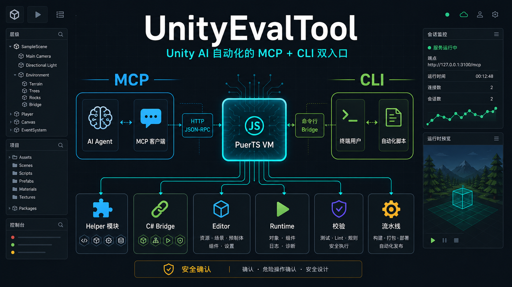

# UnityEvalTool

[](https://unity.com/releases/editor/archive)
[](https://modelcontextprotocol.io/)
[](https://github.com/Tencent/puerts)
[](LICENSE)
[](#状态与保证)

[English](README.md) | [Helper 参考](docs/HELPER_MODULES_zh.md) | [Runtime 服务](docs/RUNTIME_SERVICES_zh.md) | [项目设计](docs/PROJECT_DESIGN_zh.md) | [高级说明](docs/ADVANCED_USAGE_zh.md)

UnityEvalTool 是一个跑在 Unity 内部、给 AI Agent 使用的 MCP server。它只暴露一个 MCP tool —— `evalJsCode` —— Agent 通过它把 JavaScript 提交到 PuerTS 中执行。helper module 覆盖 Editor 和 Runtime/Player 工作流：Scene、GameObject、Component、Asset、Prefab、Importer、序列化字段、测试、构建、校验、对象格式化，以及项目自定义 C# API。



## 这个工具做什么

当你希望 AI 不只是从外部改文件，而是能进入 Unity 内部检查和操作时，使用这个包。

- 检查 Editor 和 Runtime/Player 状态。
- 查询和编辑 GameObject、Component、Scene、Asset、Prefab、Importer、序列化字段。
- 读取日志、运行校验、跑测试、检查构建设置。
- 跑项目专用 JavaScript 或直接 PuerTS `CS.*` 调用做临时调试。
- helper 或 C# tool 不够用时，直接扩展这个包。

设计上是脚本优先：一个稳定的 MCP tool，加一层按需 import 的 helper。MCP 表面保持很小，helper 层覆盖日常 Unity 自动化；helper 未覆盖时仍可直接使用 PuerTS `CS.*` interop。

## 快速开始

### 1. 先安装 PuerTS

UnityEvalTool 通过 PuerTS 在 Unity 内运行 JavaScript。安装本包前先装好：

- `com.tencent.puerts.core` —— PuerTS 核心
- 任选一个 JavaScript backend：`com.tencent.puerts.v8`、`com.tencent.puerts.quickjs`、`com.tencent.puerts.nodejs`、`com.tencent.puerts.webgl`

具体安装步骤参考官方文档：

- [PuerTS Unity 安装文档](https://puerts.github.io/docs/puerts/unity/install/)
- [PuerTS GitHub 仓库](https://github.com/Tencent/puerts)

UnityEvalTool 不依赖、不替代、也不会安装 PuerTS 自带的 `com.tencent.puerts.mcp` 包。

### 2. 安装 UnityEvalTool

选择下面任意一种方式安装。

#### 直接下载安装

1. 从 [GitHub](https://github.com/Yuze075/YuzeMcpTool) 下载 UnityEvalTool 源码或 release 压缩包。
2. 把压缩包解压到本地目录。
3. 确认解压出来的 package 文件夹里有 `package.json`、`README.md`、`Runtime` 和 `Editor`。
4. 打开你的 Unity 项目。
5. 打开 `Window/Package Manager`。
6. 点击 `+`。
7. 选择 `Add package from disk...`。
8. 选中解压后 package 文件夹里的 `package.json`。
9. 等 Unity 导入并编译完成。

如果想作为 embedded package 使用，把解压后的 package 文件夹复制到：

```text
Packages/com.yuzetoolkit.unityevaltool
```

然后重新打开或切回 Unity，等待 package 导入。

#### 通过 GitHub 链接安装

Unity Package Manager 界面安装：

1. 打开你的 Unity 项目。
2. 打开 `Window/Package Manager`。
3. 点击 `+`。
4. 选择 `Add package from git URL...`。
5. 粘贴：

```text
https://github.com/Yuze075/UnityEvalTool.git
```

6. 点击 `Add`。
7. 等 Unity 解析、导入并编译完成。

也可以手动改 `Packages/manifest.json`，把这一项加到已有 dependencies 旁边：

```json
{
  "dependencies": {
    "com.yuzetoolkit.unityevaltool": "https://github.com/Yuze075/UnityEvalTool.git"
  }
}
```

### 3. 启动 Unity 并检查服务

MCP server 安装后默认保持停止。需要 MCP 客户端连接时，打开 `UnityEvalTool/Window`，在 MCP Service 页签中手动启动。

| 项目 | 值 |
|---|---|
| MCP endpoint | `http://127.0.0.1:3100/mcp` |
| Health check | `http://127.0.0.1:3100/health` |
| MCP 协议 | HTTP POST JSON-RPC MCP session endpoint |
| 默认 Transport | 非 WebGL: `TcpListener`；WebGL: WebSocket 占位实现并明确返回不支持 |
| Editor window | `UnityEvalTool/Window` |
| 暴露的 MCP tool | `evalJsCode` |

在 `UnityEvalTool/Window` 中可以管理 Tools、启动/停止 MCP、配置 host/port/token 鉴权、复制 endpoint、查看 MCP 对话、管理 CLI bridge、复制 CLI 命令、启动 CLI、查看活跃 CLI 连接。MCP token 鉴权默认关闭；开启后客户端必须发送 `Authorization: Bearer <token>` 或 `X-UnityEvalTool-Token: <token>`。

Runtime/Player 构建可以用同一个 MCP server：脚本调用 `McpServer.Shared.Start(...)`，或在场景对象上挂 `McpServerBehaviour`。Runtime 不会自动读取 Editor 窗口写入的 `EditorPrefs`；需要把 host、port、token、timeout、session 等配置传入 `McpServerOptions`。见 [Runtime 服务](docs/RUNTIME_SERVICES_zh.md)。

### CLI Bridge

除了 MCP endpoint，包内还提供一个给 `unity` CLI 使用的本地/局域网长连接 bridge。CLI bridge 不改变 MCP 暴露面：MCP 仍只看到 `evalJsCode`；CLI 会单独拉取更完整的工具 metadata，用来生成命令行帮助和参数解析。

Unity 侧所有 CLI bridge 操作都在 `UnityEvalTool/Window` 的 CLI Service 和 CLI Consoles 页签内完成。

CLI 项目位于：

```text
Game/UnityCLI
```

构建：

```bash
dotnet build Game/UnityCLI/unity-cli.csproj
```

只传连接参数时进入持续 REPL：

```bash
unity --host 127.0.0.1 --port 49231 --token <token>
```

带命令时执行一次后退出：

```bash
unity --host 127.0.0.1 --port 49231 --token <token> -help
unity --host 127.0.0.1 --port 49231 --token <token> runtime --help
unity --host 127.0.0.1 --port 49231 --token <token> runtime getState
unity --host 127.0.0.1 --port 49231 --token <token> eval-js --code "console.log(1 + 2)"
unity --host 127.0.0.1 --port 49231 --token <token> logs dump 50
```

全局 help 只列出带简短说明的 Built-ins 和 Tools。使用 `<tool> --help` 查看该工具的 Commands，使用 `<tool> <command> --help` 查看单个命令参数。

一次性 heredoc / stdin：

```bash
unity --host 127.0.0.1 --port 49231 --token <token> eval-js <<'END_JS'
const name = "Unity";
console.log(`Hello ${name}`);
END_JS
```

REPL 内也支持 heredoc，由 `unity` 自己解析结束标记；需要实时显示 Unity 日志时执行 `logs on`，用 `logs off` 关闭，默认关闭：

```text
unity> logs on
unity> eval-js <<'END_JS'
const name = "Unity";
console.log(`Hello ${name}`);
END_JS
```

局域网连接时不要把 bridge 暴露到不可信网络；CLI bridge 的 token 鉴权可以在 CLI Bridge 窗口中开关，默认开启。开启时留空 token 会在启动时生成。它仍然是能执行 Unity 内 JavaScript 的调试入口。

Unity Test Runner、脚本编译、Domain Reload 可能关闭当前 CLI 连接。如果 bridge 是从 Editor 启动的，reload 后会自动恢复监听，但已有 CLI 进程需要重新连接。

Runtime/Player 构建可以通过 `CliBridgeServer.Shared.Start(new CliBridgeOptions { ... })` 启动 CLI bridge。`Port = 0` 会让系统自动选择可用端口，启动后从 `CliBridgeServer.Shared.State.Port` 和 `State.Token` 读取 CLI 连接参数。见 [Runtime 服务](docs/RUNTIME_SERVICES_zh.md)。

### 4. 配置 MCP 客户端

下面所有示例都连接默认本地 endpoint：

```text
http://127.0.0.1:3100/mcp
```

除非你有受控网络环境，否则保持 server 只绑定本机 loopback。需要让局域网内其他设备访问时，可以通过 `McpServerOptions.Host = "0.0.0.0"` 或 `McpServerBehaviour` 的 Host 字段监听所有 IPv4 网卡。

非 WebGL 构建在 Editor 和 Player 中统一使用基于 `TcpListener` 的 transport。WebGL 不能监听入站 TCP/HTTP 连接；当前 WebSocket transport 是占位实现，会明确返回不支持，直到后续实现 relay 协议。

#### Claude Code

CLI：

```bash
claude mcp add --transport http unityevaltool --scope project http://127.0.0.1:3100/mcp
claude mcp list
```

项目级配置写入项目根目录的 `.mcp.json`，local/user scope 写入 `~/.claude.json`。

手动 `.mcp.json`：

```json
{
  "mcpServers": {
    "unityevaltool": {
      "type": "http",
      "url": "http://127.0.0.1:3100/mcp"
    }
  }
}
```

在 Claude Code 内执行 `/mcp` 可以查看和处理已配置的 server。

#### Codex

CLI：

```bash
codex mcp add unityevaltool --url http://127.0.0.1:3100/mcp
codex mcp list
```

Codex CLI 和 Codex IDE extension 共享 `~/.codex/config.toml`。手动 TOML：

```toml
[mcp_servers.unityevaltool]
url = "http://127.0.0.1:3100/mcp"
```

直接改文件后，重启 Codex 或重新加载 MCP 配置。

#### Cursor

项目配置：`.cursor/mcp.json`，全局配置：`~/.cursor/mcp.json`。

```json
{
  "mcpServers": {
    "unityevaltool": {
      "type": "http",
      "url": "http://127.0.0.1:3100/mcp"
    }
  }
}
```

在 Cursor 中打开 Settings → MCP 添加或启用 server。CLI：

```bash
cursor-agent mcp list
cursor-agent mcp list-tools unityevaltool
```

#### Gemini CLI

CLI：

```bash
gemini mcp add --transport http unityevaltool http://127.0.0.1:3100/mcp
gemini mcp list
```

项目配置：`.gemini/settings.json`，用户配置：`~/.gemini/settings.json`。

```json
{
  "mcpServers": {
    "unityevaltool": {
      "httpUrl": "http://127.0.0.1:3100/mcp",
      "trust": false
    }
  }
}
```

如果要让 server 在当前项目外也可用，执行 `gemini mcp add` 时加 `--scope user`。

#### VS Code / GitHub Copilot

Workspace 配置：`.vscode/mcp.json`。

```json
{
  "servers": {
    "unityevaltool": {
      "type": "http",
      "url": "http://127.0.0.1:3100/mcp"
    }
  }
}
```

UI 配置：

1. 打开 Command Palette。
2. 执行 `MCP: Add Server` 或 `MCP: Open Workspace Folder MCP Configuration`。
3. 选择 HTTP，填入 `http://127.0.0.1:3100/mcp`。
4. 打开 GitHub Copilot Chat，切换到 Agent mode，在 tools picker 中启用 `unityevaltool`。

### 5. 验证连接

1. 打开 Unity 并打开 `UnityEvalTool/Window`。
2. 确认 endpoint 是 `http://127.0.0.1:3100/mcp`，并且 server 在运行。
3. 配置 MCP 客户端。
4. 让客户端列出 MCP tools，应看到 `evalJsCode`。

推荐第一条提示词：

```text
Use the Unity MCP tool. First call evalJsCode to import tools/index and read its description. Then inspect the current Unity state before making changes.
```

### 故障排查

| 问题 | 检查 |
|---|---|
| 客户端无法连接 | Unity 已打开、Server Window 显示 running、`3100` 端口空闲、URL 以 `/mcp` 结尾。 |
| 局域网设备无法连接 | 确认 Host 配置为 `0.0.0.0`，系统防火墙允许该端口，客户端 URL 使用运行 Unity 设备的局域网 IP。 |
| WebGL 中无法启动 server | WebGL 不能监听入站 TCP/HTTP 连接；当前 WebSocket transport 会明确返回不支持，直到后续实现 relay。 |
| 看不到 tools | 客户端使用 HTTP / Streamable HTTP（不是 stdio），并连接 `/mcp`，不是 `/health`。 |
| `Session not found` | 重新 initialize 或重启 MCP 客户端。Domain Reload 或 server 重启会让 session 失效。 |
| 编译期间 tool 调用失败 | 等 Unity 编译或资源刷新结束后重试。 |
| Player 中 Editor helper 失败 | Editor helper 依赖 `UnityEditor`；Runtime/Player 中改用 Runtime helper。 |

## 功能地图

| 领域 | Agent 可以做什么 |
|---|---|
| Runtime | 环境状态、日志、GameObject、Component、诊断、reflection、对象格式化。 |
| Editor | 编译状态、Selection、菜单、播放模式、截图。 |
| Assets | 搜索、读写文本资源、移动/复制/删除、依赖、脚本、材质。 |
| Scenes and Prefabs | 打开/保存 Scene、检查 hierarchy、实例化/创建 Prefab、管理 override。 |
| Serialized data | 读写 Inspector 序列化字段和数组。 |
| Pipeline | Package、测试、构建设置、构建请求。 |
| Validation | 缺失脚本、缺失引用、`[SerializeField]` Tooltip 检查。 |
| Custom logic | 生成 C# tool module、JavaScript helper 或 PuerTS C# interop，处理项目自定义 API。 |

## 设计取舍

UnityEvalTool 只暴露一个 MCP tool：

```text
evalJsCode
```

Agent 在 Unity 内运行 JavaScript，并从下面这些路径 import helper module：

```text
tools/index
tools/<name>
```

MCP 工具列表保持很小且稳定，helper 层覆盖日常 Unity 自动化。内置 helper 从带 `[EvalTool(name, description)]` 的 C# class 生成：每个生成 module 导出小型 JavaScript 函数，每次调用都会确认 tool 仍处于启用状态，再通过 PuerTS 调用 C# public 实例方法，并把返回值格式化成 MCP 输出。生成函数元数据包含有序的 `parameters` 和兼容旧字段的 `parameterTypes`。模块索引也会扫描 Unity `Resources/tools` helper module，所以项目或其他包可以新增 JavaScript helper，而不需要修改这个包的源码。一次性任务也可以直接通过 PuerTS `CS.*` 调用 Unity/C# API。

### 和多工具型 Unity MCP 插件对比

| 方案 | 更适合 | 代价 |
|---|---|---|
| UnityEvalTool | 自定义自动化、项目专用调试、Runtime/Player 检查、任意 Unity 侧 JavaScript 和 PuerTS `CS.*` interop。 | Agent 必须能写有效的 JavaScript；常见 Editor 操作不如长工具列表直观。 |
| 多工具插件 | 开箱即用的 Editor 工作流、可见的工具目录。 | 当插件没有正好对应的工具时，多步骤自定义流程难以表达。 |

### 与 PuerTS 自带 MCP 的关系

PuerTS 自带一个 MCP 相关 package（`com.tencent.puerts.mcp`）。UnityEvalTool 是独立的：自带 MCP server、session 跟踪、Unity 专用 helper module、安全标志和 Runtime/Player 支持，不依赖也不会干扰 PuerTS 的 MCP 包。

## 自己扩展工具

如果 helper 覆盖不了你的项目需求，直接扩展这个包：

1. 只是编排现有能力时，`.mjs` 或 `.js` runtime-safe helper 放在 `Resources/tools`，Editor-only helper 放在 `Editor/Resources/tools`。文件里导出 `description`，动态索引才会列出说明；新增或删除后调用 `tools/index.refreshTools()`，或点 Server Window 的 Tools 刷新按钮。
2. 需要 Unity API 或显式安全检查时，新增或扩展普通 C# class。内置 Runtime tool 放在 `Tools/Runtime`，内置 Editor tool 放在 `Tools/Editor`，命名空间保持 `YuzeToolkit`；类型上加 `[EvalTool("name", "description")]`，操作写成 public 实例方法，并在每个导出方法上用 `[EvalFunction("...")]` 写说明；生成的 `tools/<name>` module 会通过 PuerTS 直接调用这些 public 方法。
3. C# tool 通过 `EvalToolRegistry.Register<TTool>()` 或 `TryRegister<TTool>()` 注册；`TTool` 必须是有 public 无参构造的 `class`。主 Runtime 和 Editor 程序集不再直接注册内置工具：`UnityEvalTool.Tools` 自行注册 Runtime tools，`UnityEvalTool.Editor.Tools` 自行注册 Editor tools。
4. 只有存在生成元数据时才实现 `IMcpTool`。`IMcpTool` 现在只是代码生成契约，`Name`、`Description`、`Functions` 都必须返回非空对象；注册元数据优先来自 `IMcpTool`，只有非 `IMcpTool` 的普通 class 才需要 `[EvalTool]`。
5. C# tool 的 public 返回类型要写清楚，不要用 `object` 隐藏语义。优先返回基础类型、`List<T>`、`Dictionary<string, TValue>` 或由这些类型组成的数据；这是最推荐的返回类型，因为服务端一定能按 JSON 解析并作为 MCP text content 返回。
6. 新 helper 更新到 [Helper 参考](docs/HELPER_MODULES_zh.md)；破坏性操作更新到 [高级说明](docs/ADVANCED_USAGE_zh.md)。
7. 改 server、bridge、session 或 helper 架构前，先读 [项目设计](docs/PROJECT_DESIGN_zh.md)。

## 文档

| 文档 | 用途 |
|---|---|
| [README](README_zh.md) | 安装 PuerTS、安装 UnityEvalTool、配置 MCP 客户端、验证连接。 |
| [Helper 参考](docs/HELPER_MODULES_zh.md) | Runtime 和 Editor helper module 目录。 |
| [Runtime 服务](docs/RUNTIME_SERVICES_zh.md) | 从 Runtime/Player 脚本启动和配置 MCP/CLI 服务，并说明 Editor 配置一致性的边界。 |
| [项目设计](docs/PROJECT_DESIGN_zh.md) | 架构、请求流程、扩展点、生命周期规则。 |
| [高级说明](docs/ADVANCED_USAGE_zh.md) | 生成工具调用、PuerTS C# interop、安全标志、Domain Reload。 |
| [English README](README.md) | 英文概览和快速开始。 |

最小 `evalJsCode` 调用：

```javascript
async function execute() {
  const index = await import('tools/index');
  return index.description;
}
```

## 状态与保证

这个项目整体由 AI 实现。它是可修改源码和实用参考实现，不是有保证的产品。

不对正确性、稳定性、完整性、安全性或生产适用性做保证。如果缺功能或有 bug，推荐让你自己的 AI Agent 检查并修改这个包以适配你的项目。

## License

MIT License. See [LICENSE](LICENSE).
